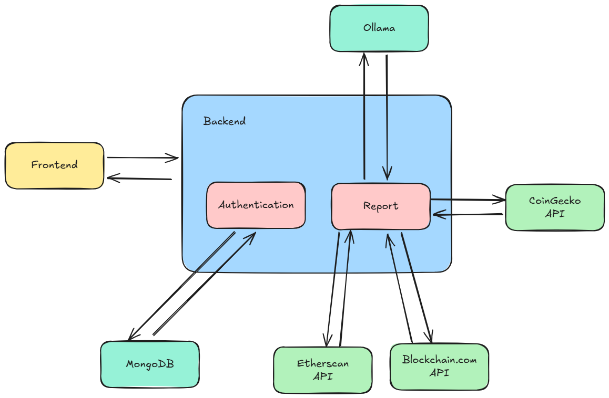

# Banker Expert — Personal Financial Intelligence

Personalized financial assistant that analyzes user data and delivers banker-style reports.

## Tech stack

- **Backend:** Node.js (Express)
- **Auth / DB:** MongoDB
- **AI:** Tinyllama
- **Crypto data:** CoinGecko API
- **Testing:** Jest
- **Frontend:** React

## Architecture

Modular monolith — clear service separation without microservices overhead.



## Features

- Express server with modular services
- Structure oriented for clarity, testing, and growth
- Crypto wallet connection and analysis
- AI-generated financial reports
- JWT auth (register / login)
- React frontend

## Requirements

- Node.js 18+
- Git
- MongoDB (local or Atlas)

## Setup

```bash
git clone https://github.com/ShamratX/AI-Banking.git
cd AI-Banking
cp .env.example .env
npm install
npm run dev
```

Fill `.env` before first run. Backend typically serves on port `8000`.

## API endpoints

| Method | Endpoint | Description |
|--------|----------|-------------|
| POST | `/auth/login` | Authenticate a user |
| POST | `/auth/register` | Register a user |
| POST | `/full-report` | Get personalized report |

## License

MIT License